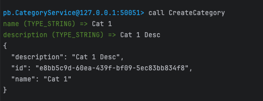
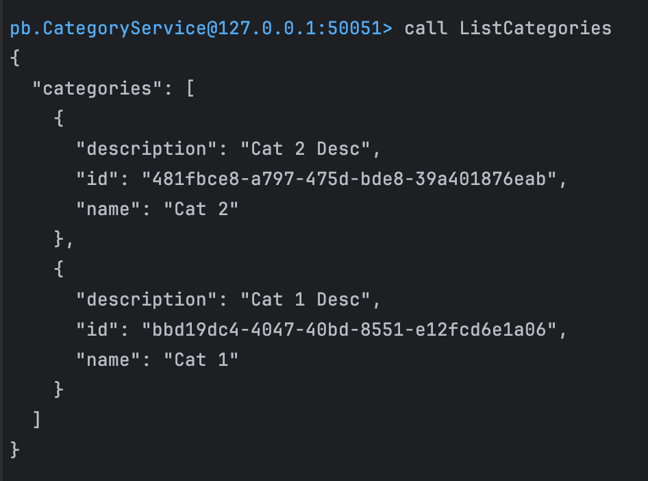
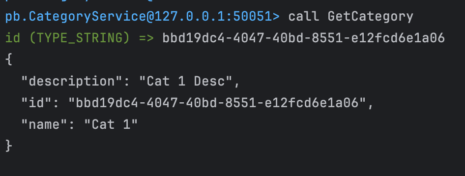
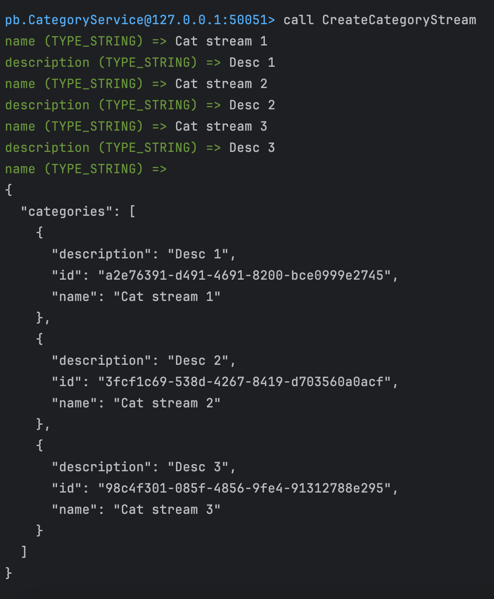

# fullcycle_gRPC

## Preparar ambiente

1- Instalar compilador do protoc:
```bash
brew install protobuf-compiler
```
2-Instalar o plugin do protoc-gen-go:
```bash
go get -u github.com/golang/protobuf/protoc-gen-go
```
3- Instalar o plugin do protoc-gen-go-grpc:
```bash
go get -u google.golang.org/grpc/cmd/protoc-gen-go-grpc
```

---

### Banco de dados: Criar categories
```bash
sqlite3 db.sqlite3
create table categories (id string, name string, description string);
```

---

### Evans - gRPC client

Instalar evans:
```bash
brew tap ktr0731/evans
brew install evans
```

nota: 
port must be :50051
utilizar reflection para acessar os serviços (reflection)

Rodar app
```bash
go run cmd/grpcServer/main.go
```

Rodar evans:
```bash
evans -r repl
package pb
service CategoryService
```

Criar categories
```bash
call CreateCategory
```


Listar categories
```bash
call ListCategories
```


Pegar category por id
```bash
call GetCategory
```


## Stream de dados
Enviar stream de dados (preenche e ctrl + d)
```bash
call CreateCategoryStream
```



## Projeto

Gerar entidades e interfaces - chamada do plugin para o arquivo proto
```
protoc --go_out=. --go-grpc_out=. proto/course_category.proto
```

